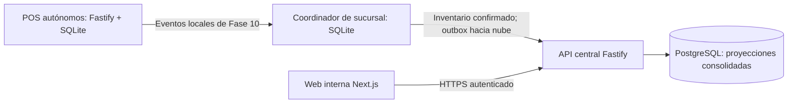

# Evolución post-MVP: almacenes, nube y consulta web

- **Fecha de aprobación:** 2026-09-06.
- **Estado:** Alcance y secuencia aprobados; implementación pendiente.
- **Índice:** [Cronograma maestro](./README.md).
- **Decisiones:** [ADR-0024](../architecture/adr/0024-inventario-multi-almacen-y-consolidacion-cloud.md) y [ADR-0025](../architecture/adr/0025-web-nextjs-y-sistema-de-diseno.md).

## Autorización y frontera

El negocio aprobó varios almacenes por sucursal (por ejemplo, depósito y piso de venta),
una Web App interna de consulta y PostgreSQL con API central en la nube, accesibles por
Internet. Aprobó Next.js para la web y una Fase 16B dedicada al sistema de diseño propio
de Cullen basado en shadcn/ui. Tailwind CSS y TanStack Query forman parte del stack previsto;
Zustand se incorpora donde exista estado compartido de interfaz que lo requiera.

**Ponytail NO aplica en Fase 16 ni en Fase 16B**, por instrucción expresa del usuario.
En esas fases se exploran y adoptan las dependencias que mejoren la experiencia de usuario,
accesibilidad, calidad visual y eficiencia de implementación. La menor cantidad de código o
dependencias no es un criterio para descartar una solución adecuada. Se conservan las reglas
de arquitectura, seguridad, licencias, pruebas y justificación concreta de cada dependencia.

Esta aprobación permite documentar la evolución; no inicia su implementación, no instala
dependencias ni despliega servicios. Las tareas del MVP y su fase activa se conservan.
La implementación futura comienza después del cierre técnico del MVP según
[alcance de entregas](../producto/alcance-entregas.md). Los gates del piloto y producción,
incluida la Fase 8 suspendida, siguen siendo obligatorios para operar en esos niveles;
no impiden diseñar ni verificar esta evolución con datos de prueba.

## Arquitectura objetivo

- El coordinador conserva la autoridad operativa sobre inventario; los POS conservan sus
  agregados propios y proyecciones locales. En standalone los papeles pueden coincidir.
- Cada almacén pertenece a una sucursal y su escritura la gobierna el coordinador autorizado.
  La asignación confiable de nodos/sucursal se especifica antes de migrar; no se deduce de
  `Device.branchId` ni cambia silenciosamente `originNodeId`.
- PostgreSQL es fuente de consulta consolidada, no un segundo escritor de los saldos locales.
  La sincronización es por contratos de aplicación, no por tablas ni archivos SQLite.
- Next.js presenta y compone la experiencia web; Fastify y aplicación autorizan y resuelven
  las consultas. Ni Server Components ni Route Handlers acceden directamente a PostgreSQL.
- El inventario visible corresponde a un punto de aplicación por sucursal. La recepción de
  un evento en la nube no significa que ya se haya aplicado. Durante un corte, la web muestra
  el último estado conocido y su antigüedad.
- Sumar proyecciones de POS y el saldo autoritativo del coordinador duplicaría existencias:
  la consolidación consume únicamente la fuente autoritativa de cada almacén.

## Secuencia y entregables

| Fase | Resultado | Dependencia de entrada |
|---|---|---|
| [13: Almacenes](./fase-13-almacenes/README.md) | Inventario por almacén, migración e intercambios dentro de la sucursal | MVP técnico cerrado; decisiones de 13.01 resueltas antes de implementar |
| [14: Plataforma central](./fase-14-plataforma-central/README.md) | API Fastify y PostgreSQL en nube con identidad, permisos y recuperación | Fase 13 cerrada |
| [15: Sincronización cloud](./fase-15-sincronizacion-cloud/README.md) | Carga inicial, entrega incremental, proyección y conciliación | Fase 14 cerrada |
| [16: Web App Next.js](./fase-16-web-app/README.md) | Consulta interna funcional, segura y adaptable | Fase 15 cerrada |
| [16B: Sistema de diseño](./fase-16b-sistema-diseno/README.md) | Sistema propio basado en shadcn/ui e integrado en la web | Fase 16 cerrada |
| [17: Validación y despliegue](./fase-17-validacion-despliegue/README.md) | Evidencia integral y despliegue gradual | Fase 16B cerrada; gates operativos aplicables |

La Fase 16 utiliza Tailwind y componentes base de shadcn/ui y termina con pantallas funcionales.
La 16B desarrolla su identidad visual definitiva, consolida componentes en una biblioteca
propia y migra esas pantallas. Así, 16 no depende de una biblioteca que todavía se crea en 16B.
No se renumeran las fases 0–12 ni se reabre 9B.08 como tarea del MVP.

## Decisiones abiertas con dueño

Son gates del trabajo dependiente, no reglas tácitas ni bloqueos para esta documentación.

| Decisión | Responsable de cerrar | Momento |
|---|---|---|
| Asignación confiable nodo/sucursal/coordinador y tratamiento de nodos existentes | Arquitectura y operación | 13.01 |
| Almacén inicial por inventario existente y datos sin correspondencia verificable | Operación de cada sucursal | 13.01, antes de 13.02 |
| Almacén de despacho por caja, recepción y restitución de devoluciones | Operación de inventario/caja | 13.01 |
| Traslado inmediato o despacho/recepción separados; parcialidad, faltantes y cancelación | Operación de inventario | 13.01, antes de 13.04 |
| Efectos sobre costo, lotes, conteos abiertos y política offline | Dominio y operación | 13.01 |
| Identidad común de producto, unidad/escala y correspondencias entre sucursales | Dueño del catálogo y arquitectura | 14.01 |
| Proveedor cloud, región, presupuesto, identidad web y recuperación de acceso | Responsable de plataforma | 14.01 |
| Corte inicial, retención/replay, identidad de eventos, cadencia y tolerancia al atraso | Arquitectura y operación | 15.01 |
| Primitivas UI, herramientas adicionales, navegadores y presupuestos de rendimiento | Responsables de UX y frontend | 16.01; identidad definitiva en 16B.01 |
| Objetivos numéricos de actualización, recuperación y volumen de aceptación | Plataforma y operación | 17.01, antes de ensayos |

No se decide aquí una marca cloud, un plazo de entrega o un coste sin capacidad y presupuesto
acordados. Las versiones de dependencias se verifican y fijan al iniciar su implementación.

## Criterios transversales de aceptación

- Toda invariante de negocio tiene una prueba observable conforme ADR-0007.
- La migración conserva IDs, historia, cantidades y valoración verificables; no inventa
  sucursal, origen ni saldos iniciales cuando falta evidencia.
- Un movimiento confirmado produce como máximo un efecto en la proyección, incluso si se
  reentrega; un mismo ID con contenido distinto queda aislado.
- Un corte de Internet no bloquea la operación local permitida por su política offline.
- Carga inicial y cambios concurrentes no dejan huecos ni cuentan el mismo movimiento dos veces.
- Datos de sucursales o usuarios distintos no se filtran mediante API, SSR o cachés del cliente.
- Cada cantidad tiene unidad y escala; los totales centrales se calculan con precisión exacta
  y no agregan magnitudes incompatibles.
- La web diferencia cero confirmado, ausencia de carga, datos antiguos y aplicación pendiente.
- La Fase 16B deja componentes documentados, accesibles y utilizados por la web.
- Las expectativas de fallo permanecen rotuladas como futuras hasta tener evidencia:
  [FS-009](../failure-scenarios/FS-009-consolidacion-cloud-interrumpida.md) y
  [FS-010](../failure-scenarios/FS-010-transferencia-interna-interrumpida.md).

## Fuera de alcance

- Portal público, comercio electrónico o reservas prometidas a clientes.
- Ajustes, recepciones, transferencias o ventas comandados desde la web.
- Almacén central independiente y transferencias entre sucursales/nodos dueños distintos.
- Gobierno central de catálogo o escritura cloud de inventario operativo.
- Sustituir SQLite local, rehacer Electron o extender el sistema de diseño al desktop.
- SaaS multiempresa, certificación fiscal nueva o promesas de stock global durante desconexión.

## Mantenimiento

Cada fase tiene README y cada sub-fase su ficha de objetivo, tareas y aceptación.
Al implementar se detallan las especificaciones aprobadas antes del código, se actualizan los
ADRs afectados y se registra evidencia de pruebas. Solo las tareas ejecutadas se marcan
`- [x] ~~tarea~~`; aprobar el plan no equivale a completar una fase.

## Verificación de esta planificación

Corte documental del 2026-09-06: seis fases y veintidós sub-fases, todas con ejecución
pendiente. Se verificaron los enlaces locales de los 44 documentos nuevos o actualizados
y `git diff --check` sin errores. `pnpm install --offline --frozen-lockfile` confirmó el
entorno existente sin cambios de dependencias; `pnpm test` pasó 667 pruebas en 124 archivos
y `pnpm typecheck` pasó. Las dos últimas comprobaciones se ejecutaron fuera del sandbox
tras restricciones de lectura del entorno.

Estos resultados corresponden a la suite vigente del workspace. No constituyen pruebas de
las capacidades futuras aquí planificadas ni completan sus criterios de aceptación.
