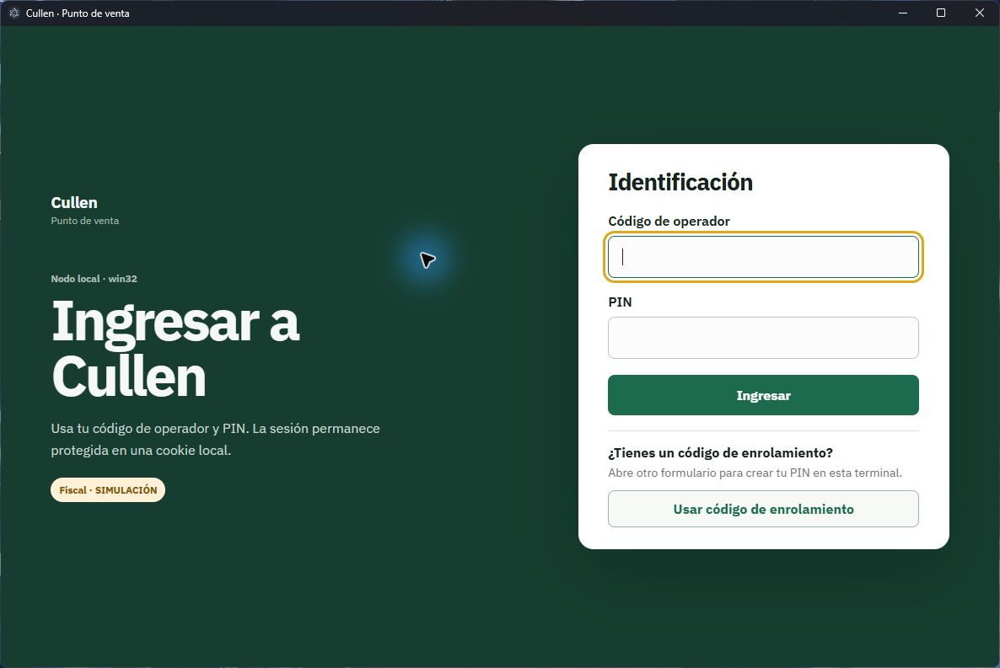
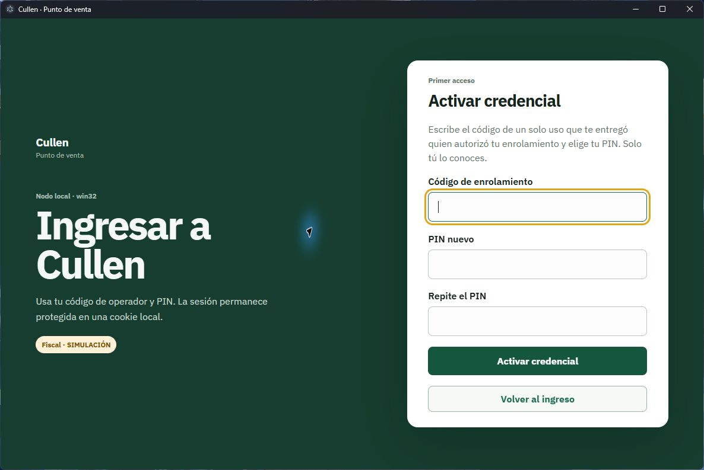
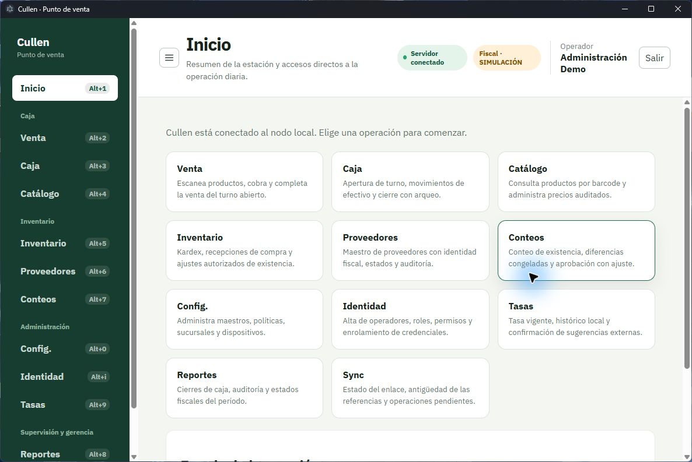

# 1 · Primeros pasos

## Para qué sirve

Este capítulo cubre todo lo que ocurre antes de que puedas trabajar: entrar con tu usuario, crear
o cambiar tu PIN, y entender lo que rodea siempre a tu pantalla. También explica por qué tu
compañero ve pantallas que tú no ves.

## Cuándo la vas a usar

El primer día, cada vez que enciendas la terminal, y el día en que algo no aparezca donde
esperabas.

## Antes de empezar: qué es esto

Cada caja de la tienda tiene su propia copia de la aplicación funcionando en su computadora. Esa
copia trabaja sola: aunque se caiga la red, puedes seguir vendiendo. Después, cuando la red
vuelve, tu estación le cuenta al [coordinador](./glosario.md) lo que hizo. Por eso el manual habla
de «esta estación» y no de «el sistema»: lo que tú registras vive primero acá.

---

## Entrar

### Qué ves

La pantalla pide dos datos: **Código de operador** y **PIN**.

El **código de operador** te lo asigna quien administra la tienda. No es tu nombre: suele ser algo
corto, como `caja01` o tus iniciales. Si no lo sabes, pídeselo; no se puede adivinar ni recuperar
desde esta pantalla.

El **PIN** es tuyo y solo tuyo: entre 6 y 12 dígitos. Nadie más lo conoce, ni siquiera quien
administra. Si lo olvidas, esa persona puede darte uno nuevo, pero no puede decirte el anterior.

Ya en esta pantalla verás el rótulo **Fiscal · SIMULACIÓN**. Está explicado
[más abajo](#qué-significa-simulación).

### Paso a paso

1. Escribe tu **Código de operador**.
2. Escribe tu **PIN**.
3. Pulsa **Ingresar**.

La sesión queda abierta **en esta terminal**, no en tu usuario: si te sientas en otra caja, tienes
que entrar de nuevo allá. Cuando termines tu turno, pulsa **Salir** en la esquina superior
derecha. No dejes la sesión abierta para el siguiente: todo lo que se haga queda registrado a
nombre de quien está conectado.

---

## Activar tu credencial (solo la primera vez)

Cuando quien administra te da de alta, existes como operador, pero **todavía no tienes PIN en esta
terminal**. Para crearlo te entrega un **código de enrolamiento**: una clave de un solo uso.

### Qué ves

### Paso a paso

1. En la pantalla de ingreso, pulsa **Usar código de enrolamiento**.
2. Escribe el **Código de enrolamiento** que te entregaron.
3. Elige tu **PIN nuevo**, de 6 a 12 dígitos, y escríbelo otra vez en **Repite el PIN**.
4. Pulsa **Activar credencial**.

Verás el aviso *Credencial activada*. Ya puedes volver al ingreso y entrar normalmente.

### Qué pasa si sale mal

- **«El código de enrolamiento venció: pide uno nuevo.»** — Los códigos caducan a propósito, para
  que uno olvidado en un papel no sirva para siempre. Pide otro.
- **«Ese código ya se usó: pide uno nuevo.»** — Sirve una sola vez. Si tú no lo usaste, avisa:
  alguien más lo hizo.
- **«Ese código pertenece a otra terminal.»** — El código se emite para la caja donde vas a
  trabajar. Pide uno para esta.
- **«El código de enrolamiento no es válido.»** — Revisa que lo hayas copiado completo, sin
  espacios de más.

---

## Cambiar tu PIN cuando la aplicación te lo exige

A veces, al entrar, la aplicación no te deja pasar y muestra **Cambia tu PIN para continuar**. No
es un error: quien administra caducó tu credencial —porque te dio un PIN provisional, o porque
hubo que restablecerlo—. Hasta que definas uno nuevo, esta estación no habilita ninguna otra
operación.

### Qué ves

> 📷 **Captura pendiente** — `03-cambio-de-pin.png`.
> *Texto alternativo previsto:* «Pantalla "Cambia tu PIN para continuar" con la leyenda "Sesión
> restringida", los campos PIN actual, PIN nuevo y Repite el PIN nuevo, y los botones Guardar PIN
> y Salir.»

> **Problema conocido en esta versión:** al ingresar con una credencial caducada puede aparecer
> **«No pudimos conectar con el nodo»** aunque el servidor esté funcionando. En ese caso el
> formulario de cambio no llega a abrirse. Avisa a quien administra e indica que ocurrió después
> de caducar el PIN. No envíes tu PIN ni sigas probando combinaciones. Los pasos siguientes
> corresponden al formulario cuando esté disponible.

### Paso a paso

1. Escribe tu **PIN actual**, el que te entregaron.
2. Escribe el **PIN nuevo** y repítelo.
3. Pulsa **Guardar PIN**.

Puedes cambiar tu PIN cuando quieras, no solo cuando te lo exijan; pídeselo a quien administra.

### Qué pasa si sale mal

- **«El PIN actual no es correcto.»** — Vuelve a escribirlo. Los tres campos se borran después de
  cada intento, a propósito: hay que escribirlo completo otra vez.
- **«El PIN debe tener entre 6 y 12 dígitos.»** — Solo números, sin letras ni símbolos.
- **«El PIN nuevo y su confirmación no coinciden.»** — Los dos últimos campos tienen que ser
  idénticos.

---

## La pantalla de Inicio

Al entrar llegas a **Inicio**.

Tiene dos partes:

- **Los accesos directos**: una tarjeta por pantalla, con lo que hace cada una. Son exactamente
  las pantallas que tu usuario alcanza, ni una más.
- **Estado de la estación**: el **Modo fiscal** —que dirá *Simulado*— y si los **Reportes X/Z**
  están habilitados.

---

## Moverte por la aplicación

A la izquierda está la barra de navegación, con las pantallas agrupadas por tipo de trabajo:

| Grupo | Pantallas |
|---|---|
| *(sin título)* | **Inicio** |
| **Caja** | **Venta**, **Caja**, **Catálogo** |
| **Inventario** | **Inventario**, **Proveedores**, **Conteos** |
| **Administración** | **Config.**, **Tasas**, **Identidad** |
| **Supervisión y gerencia** | **Reportes**, **Sync** |

Cada entrada muestra su atajo de teclado. Mantén pulsada **Alt** y la tecla:

| Pantalla | Atajo | | Pantalla | Atajo |
|---|---|---|---|---|
| Inicio | **Alt+1** | | Reportes | **Alt+8** |
| Venta | **Alt+2** | | Tasas | **Alt+9** |
| Caja | **Alt+3** | | Config. | **Alt+0** |
| Catálogo | **Alt+4** | | Identidad | **Alt+i** |
| Inventario | **Alt+5** | | Sync | **Alt+s** |
| Proveedores | **Alt+6** | | | |
| Conteos | **Alt+7** | | | |

**Ojo con los dos últimos:** Identidad y Sync no usan un número, sino una letra — **Alt+i** y
**Alt+s**.

Puedes **ocultar la barra** con el botón de tres líneas, arriba a la izquierda, para ganar espacio
en la pantalla de Venta. La aplicación recuerda tu elección aunque cierres y vuelvas a abrir,
porque es una preferencia de ese puesto de trabajo.

---

## La barra superior

Está siempre visible y tiene, de izquierda a derecha:

- **El botón de tres líneas**, que oculta o muestra la barra de navegación.
- **El nombre de la pantalla** donde estás, y debajo, una línea que explica para qué sirve.
- **El estado de la conexión**: dice **Servidor conectado** cuando todo va bien, o **Sin conexión
  con el nodo** cuando la aplicación no logra hablar con su propia estación. Esto último no es lo
  mismo que quedarse sin Internet: significa que el programa que guarda tus datos no está
  respondiendo. Avisa a quien administra.
- **Fiscal · SIMULACIÓN**, el rótulo que explicamos abajo.
- **Tu nombre** y el botón **Salir**.

---

## Por qué no veo una pantalla

La barra de navegación muestra **solo las pantallas que tu usuario tiene habilitadas**. Si tu
compañero ve **Reportes** y tú no, no es una falla ni un problema de tu computadora: tu usuario no
tiene habilitada esa tarea.

Lo mismo ocurre dentro de una pantalla: puedes ver una sección pero tener un botón deshabilitado,
o abrir una pantalla y encontrar el aviso **No tienes autorización para esta pantalla**.

**Qué hacer:** pídele el acceso a quien administra la estación, diciéndole qué necesitas hacer
—«abrir y cerrar el turno de la caja 2», «ver los cierres del día»—. No hace falta que le digas
ningún código.

Vale la pena saber una cosa: **esconder una pantalla no es lo que protege al sistema**. Aunque
alguien llegara a una pantalla que no le corresponde, la estación vuelve a comprobar cada acción
antes de hacerla, y la rechaza. Lo que ves es una comodidad; la seguridad está debajo.

---

## Qué significa `SIMULACIÓN`

Verás el rótulo **Fiscal · SIMULACIÓN** en la pantalla de ingreso, en la barra superior de todas
las pantallas, y en cada factura y cada reporte que emitas.

> **Este sistema opera en modo simulado.** Las facturas, notas y reportes X y Z que emite son
> ejercicios de práctica: no tienen validez fiscal ni legal, aunque se vean como los de verdad. La
> aplicación lo dice en pantalla con el rótulo **SIMULACIÓN**, y ese rótulo no se puede quitar.

Esta versión **no imprime en una impresora fiscal real**. Todo lo que hagas es válido como
práctica y como registro interno de la tienda, y nada más.

---

## Qué pasa si sale mal

| Qué viste | Qué pasó | Qué hacer |
|---|---|---|
| **Conectando con el nodo**, y se queda ahí | La aplicación está buscando su estación | Espera unos segundos. Si no avanza, mira la entrada siguiente |
| **No pudimos conectar con el nodo** | El programa que guarda los datos de esta caja no está funcionando | Pulsa **Reintentar**. Si sigue igual, avisa a quien administra: hay que arrancar el servicio de la estación |
| **No tienes autorización para esta pantalla** | Llegaste a una pantalla que tu usuario no tiene habilitada | Vuelve con **Alt+1** y pide el acceso si lo necesitas |
| **No pudimos dibujar esta pantalla** | Falló el dibujo de la pantalla, no la operación | Pulsa **Reintentar** o cambia de pantalla. Lo que ya registraste está a salvo |
| **Tu credencial está caducada: cambia tu PIN para continuar** | Quien administra caducó tu PIN | [Cambia tu PIN](#cambiar-tu-pin-cuando-la-aplicación-te-lo-exige) |

El capítulo [6 · Cuando algo no sale como esperabas](./06-cuando-algo-falla.md) tiene la lista
completa.
