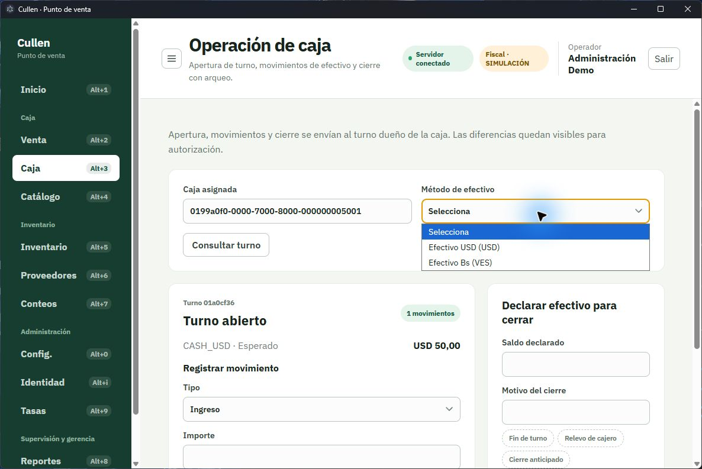
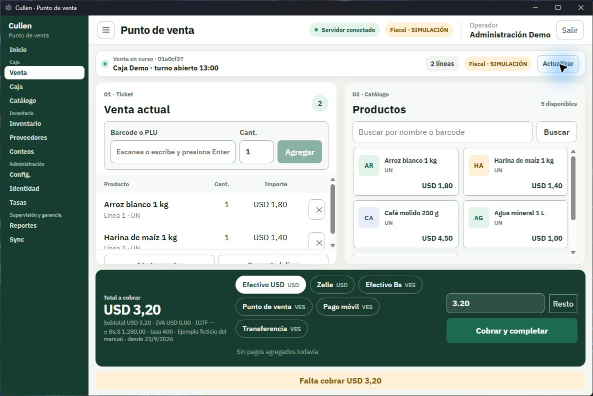
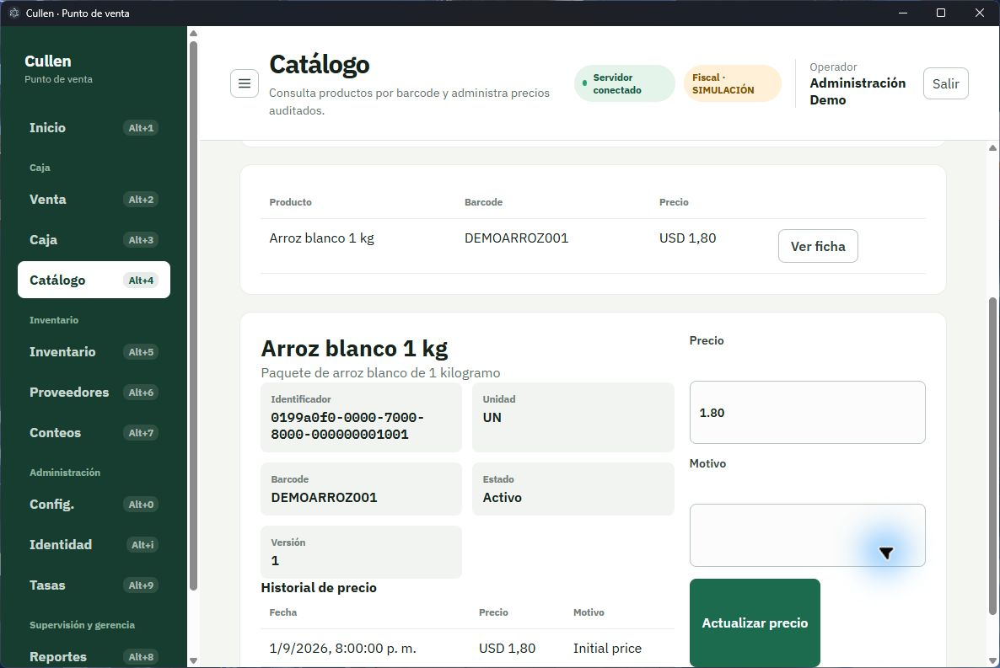

# 2 · Caja

Tres pantallas: **Caja**, donde empieza y termina tu jornada; **Venta**, donde pasas el día; y
**Catálogo**, para consultar precios.

El orden importa. **Sin un turno abierto no se puede vender**, así que este capítulo empieza por
la caja aunque tú vayas a pasar más tiempo en la venta.

---

# Caja

## Para qué sirve

Abrir tu turno al empezar, registrar el efectivo que entra o sale durante el día, y cerrar
contando lo que hay.

## Cuándo la vas a usar

Al empezar tu jornada, cada vez que saques o metas efectivo por algo que no es una venta, y al
terminar.

## Cómo llegar

Grupo **Caja** → **Caja**. Atajo: **Alt+3**.

## Qué ves

Arriba, una nota recuerda que todo lo que registres se envía al turno dueño de esa caja y que las
diferencias quedan visibles para que alguien las autorice.

## Paso a paso

### Abrir el turno

1. Elige la **Caja asignada** de esta estación.
2. Elige el **Método de efectivo** con el que declaras el fondo.
3. Escribe el **Fondo inicial**: el efectivo con el que arrancas.
4. Pulsa **Abrir turno**.

**El segundo paso es el que más se olvida.** Mientras no elijas el método de efectivo, el botón
**Abrir turno** sigue deshabilitado aunque ya hayas escrito el fondo.

Queda a la vista el panel **Turno abierto**, con su identificador corto y la cuenta de
movimientos. Desde ahí ya puedes ir a **Venta**.

Si vuelves más tarde y quieres ver el turno en curso, pulsa **Consultar turno**.

**La estación recuerda su caja**, así que al día siguiente la encuentras ya elegida. El turno
abierto, en cambio, lo vuelve a preguntar cada vez: por eso no te encuentras un turno de ayer
«pegado» después de haberlo cerrado.

> **Si la estación no tiene ninguna caja**, la pantalla lo dice —*Este nodo todavía no tiene
> ninguna caja registrada, así que no hay turno que abrir*— y remite a **Configuración**. Las cajas
> las crea quien administra y pertenecen a la terminal donde se declaran. No inventes un nombre:
> pídele que la cree en *esta* estación. Está en el [capítulo 4](./04-administracion.md).

> **Si la tasa del dólar no es de hoy**, arriba aparece un aviso con la tasa que está rigiendo,
> su fuente y su fecha —*Tasa USD/VES del 22/9/2026: 400,00 · …*— y un enlace a **Tasas**. Es
> la tasa con la que se calculan los bolívares en la venta. Si el BCV ya publicó una nueva, pide a
> quien administra que la registre antes de cobrar. **El aviso no te impide abrir el turno:** un
> sábado, por ejemplo, sigue rigiendo la del viernes y el aviso aparece igual. Si dice *No hay
> tasa USD/VES registrada*, falta cargarla; si dice *No se pudo comprobar la tasa*, la estación
> no logró consultarla y conviene revisarla en **Tasas**.

### Registrar un ingreso o un retiro

Úsalo cuando el efectivo de la caja cambia por algo que no es una venta: un vuelto que trajiste,
un pago al proveedor del agua, un retiro a la caja fuerte.

1. En **Registrar movimiento**, elige el **Tipo**: **Ingreso** o **Retiro**.
2. Elige el **Método de efectivo**.
3. Escribe el **Importe**.
4. Escribe el **Motivo**.
5. Pulsa **Registrar movimiento**.

**El motivo es obligatorio, siempre.** No es burocracia: al cerrar el turno, la diferencia entre
lo que el sistema esperaba y lo que contaste se explica con esos motivos. Sin ellos, una
diferencia legítima parece un faltante.

### Cerrar el turno con arqueo

1. Cuenta el efectivo que hay realmente en la caja.
2. En **Declarar efectivo para cerrar**, escribe el **Saldo declarado**.
3. Escribe el **Motivo**.
4. Pulsa **Cerrar turno**.

La pantalla muestra tres números: **Esperado** —lo que el sistema calculó—, **Declarado** —lo que
contaste— y **Diferencia**.

**Una diferencia no te obliga a cuadrar el número a mano.** Queda registrada con tu nombre y tu
motivo, y tu supervisor la revisa desde [Reportes](./05-supervision-y-gerencia.md). Lo que importa
es que declares lo que contaste de verdad: forzar el número esconde el problema en vez de
resolverlo.

> **Cerrar un turno descuadrado es una autorización aparte.** Cerrar uno que cuadra lo puede hacer
> cualquier cajero; cerrarlo con diferencia, no. Si al pulsar **Cerrar turno** aparece *No tienes
> autorización para esta operación* y tus números no coinciden, no es que el cierre esté mal
> hecho: hace falta que lo cierre alguien que tenga esa autorización, o que te la habiliten. No
> cambies el saldo declarado para esquivarlo.

## Qué pasa si sale mal

- **«La caja conserva ventas sin cerrar: cóbralas o anúlalas antes del arqueo.»** — Hay una venta
  a medias. Vuelve a **Venta**, y complétala o anúlala. Después cierra.
- **«La caja ya tiene un turno abierto.»** — Alguien ya lo abrió, quizá en el turno anterior.
  Pulsa **Consultar turno** para verlo.
- **«No hay un turno abierto para esta caja.»** — Ábrelo antes de seguir.
- **«El turno no puede modificarse en este estado.»** — Ya está cerrado. Un turno cerrado no se
  reabre; se abre uno nuevo.

---

# Venta

## Para qué sirve

Cobrar. Armar el ticket, aplicar descuentos si te corresponde, recibir el pago en uno o varios
medios y completar la venta.

## Cuándo la vas a usar

Todo el día, con un cliente delante. Por eso esta pantalla tiene lo importante siempre a la vista
y el botón principal siempre te dice qué falta.

## Cómo llegar

Grupo **Caja** → **Venta**. Atajo: **Alt+2**.

## Qué ves

La pantalla tiene tres zonas:

- **01 · Ticket** — a la izquierda: lo que el cliente lleva.
- **02 · Catálogo** — a la derecha: para buscar un producto cuyo código no puedes leer.
- **La barra de cobro** — abajo, de lado a lado: el total, los medios de pago y el botón principal.

## Paso a paso

### Abrir el carrito

1. Comprueba el aviso del turno. Si dice **Esta estación no tiene un turno abierto**, ve a
   **Caja** (**Alt+3**), ábrelo y vuelve.
2. Confirma la **Moneda de venta**.
3. Pulsa **Iniciar venta**.

### Agregar productos

**Con el lector:** el cursor ya está en el campo del código. Pasa el producto por el lector; la
línea se agrega sola. También puedes escribir el código y pulsar **Enter**.

**Buscando por nombre:** escribe en **Buscar por nombre o barcode**, en el panel del catálogo, y
elige el producto de la lista.

> **La cantidad tiene que respetar la unidad del producto.** Lo que se vende por unidades va
> entero: **3**, no 3,5. Lo que se vende por peso admite decimales, tantos como su unidad permita
> —normalmente tres, para gramos—. Si escribes más decimales de los que la unidad acepta, la
> pantalla responde *La cantidad de decimales supera la escala configurada.* y la línea no se
> agrega.
>
> No tienes que saber de memoria cuál es cuál: quien administra lo definió al crear la unidad, y
> el aviso aparece antes de que el producto entre al ticket.

### Corregir el ticket

- **Cambiar la cantidad**: escribe la nueva en la columna **Cant.** de esa línea.
- **Quitar una línea**: usa el botón de la propia línea.
- **Aplicar un descuento**: pulsa **Descuento de línea**, elige la **Línea**, escribe el descuento
  en el campo **Porcentaje (puntos base)** y el **Motivo**, y confirma. Queda registrado con tu
  nombre.

> **Ese campo no se escribe como un porcentaje corriente.** Pide *puntos base*: hay que agregarle
> dos ceros. Un **10 %** se escribe **1000**, un **5 %** se escribe **500** y un **2,5 %** se
> escribe **250**. Si escribes **10**, no estás dando un 10 % sino un 0,10 %, y el cliente no lo
> va a notar en el total.
>
> | Descuento que quieres dar | Qué escribes |
> |---|---|
> | 1 % | 100 |
> | 5 % | 500 |
> | 10 % | 1000 |
> | 15 % | 1500 |
> | 50 % | 5000 |

> **El descuento tiene un tope** que fija la administración de la tienda. Si lo superas, la venta
> no lo acepta. Si de verdad hace falta un descuento mayor, tiene que autorizarlo quien pueda
> hacerlo.

### Leer el total

En la barra de abajo, **Total a cobrar** es el número grande. Debajo, en letra pequeña, su
composición: **Subtotal**, **IVA** e **IGTF**.

El **IGTF** solo aparece con un importe cuando pagas con un medio que lo lleva. Esos medios están
marcados con **+IGTF** en su etiqueta. No lo calculas tú: lo hace la estación.

Si la venta es en dólares, una tercera línea da el **total en bolívares**: *≈ Bs 40.000,00 · tasa
400,00 · BCV · dólar oficial · desde 23/9/2026*. Sirve para decirle al cliente cuánto es en
bolívares y con qué tasa. Es una referencia: los pagos que agregas siguen siendo los que cuentan.
Si dice *Sin tasa USD/VES*, no hay tasa registrada y no puedes dar el equivalente; avisa a quien
administra.

### Cobrar

**Con un solo medio de pago:**

1. Pulsa el medio de pago que corresponda.
2. Escribe el **Importe**, o pulsa **Resto** para que ponga lo que falta.
3. Pulsa **Cobrar y completar**.

**Con varios medios (pago mixto):**

1. Elige el primer medio y escribe su importe.
2. Pulsa **Agregar pago**. La línea aparece en la fila de pagos.
3. Repite con los demás medios. **Resto** te pone siempre lo que queda.
4. Cuando el saldo esté cubierto, pulsa **Completar venta**.

Bajo el botón, una línea te dice siempre en qué punto estás: **Falta cobrar…** o **Cobro
cubierto**. Si el medio elegido lleva IGTF, esa línea te dice también cuánto hay que recibir con
ese medio, impuesto incluido.

**El botón principal nunca miente:** si está deshabilitado, el texto de arriba explica por qué
—falta cobrar, el pago supera el total, o no hay ninguna línea—.

**Cobrar en otra moneda:** elige el medio de pago de esa moneda. La conversión usa la tasa vigente
en ese momento, y esa tasa queda guardada con la venta: si mañana cambia, esta venta no cambia.

### Qué ocurre al completar

En ese mismo momento, y de una sola vez, pasan dos cosas: el cobro queda asentado en tu turno y
**lo vendido sale de la existencia** del inventario. No tienes que descontar nada a mano.

> **Si la existencia no alcanza, la venta no se cae.** Puede ocurrir que el sistema tenga menos de
> lo que acabas de vender —porque faltó registrar una entrada, o porque el mismo producto se vendió
> en dos cajas a la vez—. Cuando pasa, **la venta se conserva y el cobro también**: el cliente ya
> pagó y su ticket es válido. Lo que queda es el inventario descuadrado, anotado para que alguien
> lo revise.
>
> **Qué te toca a ti:** nada en el momento —sigue atendiendo—, y avisar a depósito al terminar,
> para que cuadren ese producto.

### Emitir la factura

Al completar, la pantalla muestra el resumen de la venta y, debajo, **Emitir factura**.

> **Este sistema opera en modo simulado.** Las facturas, notas y reportes X y Z que emite son
> ejercicios de práctica: no tienen validez fiscal ni legal, aunque se vean como los de verdad. La
> aplicación lo dice en pantalla con el rótulo **SIMULACIÓN**, y ese rótulo no se puede quitar.

1. Si el cliente pide la factura a su nombre, pulsa **Receptor fiscal** *antes* de emitirla,
   escribe el **País** y la **Identificación** —el nombre y la dirección son opcionales— y pulsa
   **Adjuntar receptor**. Si te equivocaste, **Quitar receptor**.
2. Pulsa **Emitir factura**.

Verás el número del documento y su estado.

**Por qué facturar es un paso aparte y no ocurre solo al completar:** si el dispositivo fiscal
fallara, no se puede deshacer un cobro que ya quedó asentado en tu turno. Separarlo permite
reintentar la factura sin tocar el dinero.

Una venta sin receptor es válida en simulación: no hace falta pedirle los datos a todo el mundo.

### Anular y devolver

Son cosas distintas:

- **Anular** es para una venta **que todavía no has completado**. Pulsa **Anular venta**, escribe
  el motivo y confirma. No hubo cobro, no hubo movimiento de existencia.
- **Devolver** es para una venta **ya completada y facturada**. Devuelve el producto a la
  existencia —al mismo lote del que salió y con el costo que tenía entonces, no con el de hoy— y
  registra el reintegro del dinero en el turno donde se cobró.

Para devolver:

1. En el resumen de la venta completada, busca **Devolver venta completa**.
2. Si la venta aún no tiene factura, emítela primero: la nota de crédito se deriva de ese
   documento y sin él la devolución no procede.
3. Escribe el **Motivo**.
4. Pulsa **Registrar devolución**.

Se emite una **nota de crédito** y la venta queda devuelta. **Solo está disponible como devolución
total**: no se devuelven artículos sueltos de una venta.

Ninguna de las dos se deshace. Ambas quedan registradas con tu nombre y tu motivo.

### Si la impresión no responde

Puede pasar que emitas la factura y la aplicación no te confirme nada, o que quede en un estado
que no entiendes.

**No vuelvas a emitirla una y otra vez.** La estación guarda evidencia de lo que pasó
precisamente para que nadie tenga que adivinar, y un reintento a ciegas es lo que produce dos
documentos por una venta. Anota la hora y el identificador de la venta, avisa a tu supervisor, y
sigue atendiendo: el cobro ya está asentado en tu turno. Está explicado con calma en el
[capítulo 6](./06-cuando-algo-falla.md#cuando-una-operación-queda-incierta).

## Qué pasa si sale mal

- **«Esta estación no tiene un turno abierto.»** — Ve a **Caja** (**Alt+3**) y ábrelo.
- **«El catálogo no respondió. Puedes seguir usando el lector.»** — Solo falló el panel de
  búsqueda. El lector sigue funcionando. Pulsa **Reintentar** cuando puedas.
- **«No encontramos ese producto.»** — El código no está en el catálogo, o el producto está
  inactivo. Búscalo por nombre; si tampoco aparece, avisa a quien administra el catálogo.
- **«El pago no coincide con el total de la venta.»** — Revisa los pagos agregados: sobra o falta.
- **«La venta no puede modificarse en este estado.»** — Ya está completada o anulada. Pulsa
  **Iniciar otra venta**.
- **«El método de pago no está habilitado.»** — Ese medio no está configurado en esta tienda.
- **«La cantidad de decimales supera la escala configurada.»** — Ese producto no se vende
  fraccionado, o admite menos decimales de los que escribiste. Redondea a lo que la unidad acepte.
- **«La existencia no alcanza…»** — No hay suficiente producto registrado. Avisa a depósito.

---

# Catálogo

## Para qué sirve

Consultar un producto: su precio, su unidad, sus códigos y cómo ha cambiado de precio. Si tu
perfil lo permite, también cambiarlo o crear un producto nuevo.

## Cuándo la vas a usar

Cuando un cliente pregunta un precio, cuando un código no lee, o cuando hay que actualizar
precios.

## Cómo llegar

Grupo **Caja** → **Catálogo**. Atajo: **Alt+4**.

## Qué ves

## Paso a paso

### Buscar un producto

- **Por código:** escribe el código en **Nombre o barcode** y pulsa **Abrir ficha por barcode**.
- **Por nombre:** escribe parte del nombre y pulsa **Buscar en el catálogo**. Luego, **Ver ficha**
  en la fila que buscabas.

La ficha muestra el nombre, la descripción, la **Unidad**, los **Barcode**, el **Estado** —activo
o inactivo— y el **Historial de precio**.

### Actualizar un precio

1. Abre la ficha del producto.
2. Escribe el nuevo **Precio**.
3. Escribe el **Motivo**.
4. Pulsa **Actualizar precio**.

**Por qué se pide un motivo:** ningún precio cambia sin dejar rastro. El historial conserva qué
precio hubo, desde cuándo, quién lo cambió y por qué. Así, cuando alguien pregunte por qué un
producto se vendió a otro precio la semana pasada, la respuesta está en la ficha y no en la
memoria de nadie.

Si el botón está deshabilitado, tu usuario no tiene habilitado cambiar precios.

## Qué pasa si sale mal

- **«No encontramos ese producto.»** — Revisa el código, o busca por nombre.
- **«Sin registros.»** en el historial — El producto nunca cambió de precio desde que se creó.
- El botón **Actualizar precio** o **Nuevo producto** deshabilitado — Tu usuario no tiene esa
  tarea habilitada. Pídesela a quien administra.
